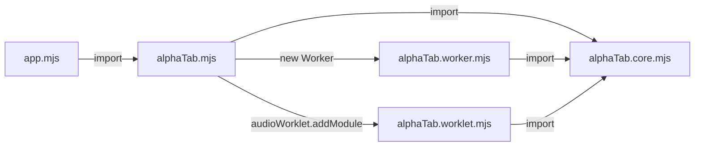

import Tabs from '@theme/Tabs';
import TabItem from '@theme/TabItem';
import { SinceBadge } from '@site/src/components/SinceBadge';

<SinceBadge since="1.3.0" />

:::info
**太长不看：** AlphaTab 附带了一个 Vite 插件，应将其添加到您的 Vite 配置中以确保兼容性。
```js
import { defineConfig } from "vite";
import { alphaTab } from "@coderline/alphatab-vite";

export default defineConfig({
  plugins: [alphaTab()]
});
```
:::

alphaTab 在内部将部分工作卸载到后台工作线程，以避免在渲染或生成音频时阻塞浏览器。
这些后台工作线程通过 [Web Workers](https://developer.mozilla.org/en-US/docs/Web/API/Web_Workers_API) 和 [Audio Worklets](https://developer.mozilla.org/en-US/docs/Web/API/Web_Audio_API/Using_AudioWorklet) 实现。

在没有像 Vite 这样的打包工具时，alphaTab 只是通过启动 `./alphaTab.worker.[m]js` 或 `./alphaTab.worklet.[m]js` 来启动这些工作线程。不使用打包工具、使用 JavaScript 模块时的依赖关系图如下所示：



Vite 可能会拆分和合并文件，导致 alphaTab 无法定位工作线程的正确入口点。

因此，alphaTab 提供了一个自定义的 Vite 插件，负责自动配置 Vite 并确保所有功能按预期工作：

* 它确保 alphaTab 附带的 Web 字体（Bravura）和 SoundFont（SONiVOX）被复制到构建输出中，并通过应用程序的 `<root>/font/` 和 `<root>/soundfont/` 提供。
* 它确保 Web Workers 和 Audio Worklets 被正确配置并正常工作。

如果您使用的是 Angular、React 或 Vue.js 等框架，您可以查阅它们的文档了解如何自定义 Vite 设置。通常您会在项目中找到一个 `vite.config.<ext>` 文件。
您可以查看通过 https://vitejs.dev/guide/#scaffolding-your-first-vite-project 创建的新项目。

除非您的项目设置有什么特殊之处，否则将插件添加到列表中就是您需要做的全部事情：

```js
// CommonJS
const alphaTab = require('@coderline/alphatab-vite');
// JavaScript 模块
import { alphaTab } from '@coderline/alphatab-vite';

// 将插件添加到您的配置中
export default defineConfig({
  plugins: [alphaTab()]
});
```


## 配置插件

插件的行为可以根据需要进行配置和自定义。

<Tabs defaultValue="source-dir" values={[
    { label: "alphaTab 源目录", value: "source-dir"},
    { label: "资源复制", value: "assets"},
    { label: "Audio Worklets", value: "worklets"},
    { label: "Web Workers", value: "workers"},
]}>

<TabItem value="source-dir">

默认情况下，alphaTab 文件在 `node_modules/@coderline/alphaTab/dist` 中搜索。如果您使用的是特殊的 alphaTab 构建版本，
或者您的项目结构比较特殊，您可以通过设置告诉插件在哪里找到这些文件：

```js
export default defineConfig({
  plugins: [alphaTab({
    alphaTabSourceDir: path.resolve('../../node_modules/@coderline/alphaTab/dist')
  })]
});
```

</TabItem>

<TabItem value="assets">

alphaTab 附带了捆绑的 Bravura 和 SONiVOX。alphaTab 会在运行时加载它们，因此这些资源
会被复制到构建输出中。插件的资源复制功能会将文件复制到构建输出目录
的 `/font` 和 `/soundfont` 下，并确保这些文件由 WebPack 开发服务器作为资源提供。

如果您希望自行处理资源打包和路径，或者想更改输出路径，有以下选项：

```js
// 禁用资源复制
export default defineConfig({
  plugins: [alphaTab({
    assetOutputDir: false
  })]
});

// 更改路径
export default defineConfig({
  plugins: [alphaTab({
    assetOutputDir: path.resolve('../dist/vendor/assets/')
  })]
});
```

</TabItem>

<TabItem value="worklets">

Vite 内置支持 Web Workers，但不支持 Audio Worklets。
为了填补这一空白，直到该功能可能在 Vite 中得到官方支持，alphaTab 自行提供了此功能。

如果此功能存在问题，或者使用了其他插件来支持 audio worklet，可以禁用此功能：

```js
export default defineConfig({
  plugins: [alphaTab({
    audioWorklets: false
  })]
});
```

:::warning 
如果禁用此 audio worklet 支持，可能会破坏通过 worklet 的音频播放。您可以配置
[`player.outputMode`](/docs/reference/settings/player/outputmode) 以始终使用 ScriptProcessorNode。
:::

</TabItem>

<TabItem value="workers">

Vite 内置支持 Web Workers，但存在相当多的限制。整个项目只有一个共享的 WebWorker 配置，
它可能与其他插件冲突，而 alphaTab 需要它。
因此，alphaTab 提供了一个自定义处理程序，确保 WebWorker 功能正常工作。

如果此功能存在问题，或者使用了其他插件来支持 worker，可以禁用此功能：

```js
export default defineConfig({
  plugins: [alphaTab({
    webWorkers: false
  })]
});
```

:::warning 
如果禁用此 web worker 支持，可能会破坏通过 worker 的渲染和音频播放。您可以配置
[`core.useWorkers`](/docs/reference/settings/core/useworkers) 以始终使用主线程。
UI 响应速度和整体体验到的性能可能会因此严重下降。
:::

</TabItem>

</Tabs>

## 示例

您可以在 https://github.com/CoderLine/alphaTabSamplesWeb/tree/main/src 查看示例项目，以找到可以参考的示例。
它们为不同的项目组合提供了一些非常精简的 alphaTab 设置。

:::warning
Angular 不提供内置的方式来自定义打包器配置。在最新版本中，它们使用 Vite 作为开发服务器，使用 ESBuild 进行构建。
但它们不提供对此的自定义。

流行的替代构建器 https://github.com/just-jeb/angular-builders 也尚未支持 Vite。这意味着如果您想在 Angular 应用程序中使用 AlphaTab，您必须
使用 [WebPack](installation-webpack) 作为打包器。

:::
